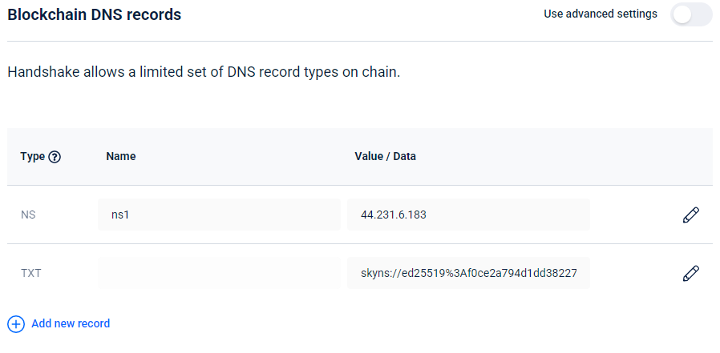

# Handshake Names


Our full documentation is still being worked on. In the meantime, here is a quick overview along with links to various resources. For a brief intro, see [Accessing Data on Skynet](../getting-started/accessing-data-on-skynet.md#handshake-names).


## What is Handshake?

Handshake is a naming protocol that’s backward-compatible with the existing DNS system. It does not replace the DNS protocol, but instead expands the root zone file where TLD ownership information is stored and the root servers with a distributed and decentralized blockchain-based system, which nobody controls and anybody can use. This allows the root zone to be uncensorable, permissionless, and free of gatekeepers like ICANN.

Every peer in the Handshake network cryptographically validates and manages the root zone, which also removes the need for the Certificate Authority system \(CAs\) entirely. Names are logged on the Handshake blockchain, which is essentially one big distributed zone file that anyone has the right to add an entry in.

## Handshake 🤝 Skynet

Skynet is built to support Handshake domains. Skynet Web Portals participate in the Handshake network, and users and developers can place entries on their Handshake DNS to tell portals where to resolve a Handshake domain name on Skynet.

## Accessing HNS Domains on Skynet

The URL used to access HNS names on Skynet is `[hns-name].hns.[portal-domain]/` . Community members will often reference this as `[hns-name].hns/`. So, for example, a portal-specific URL for `skyfeed.hns/` is [http://skyfeed.hns.siasky.net/](http://skyfeed.hns.siasky.net).


Less commonly, you may also see `http://[portal-domain]/hns/[hns-name]/`, but this format will break many web apps and is not recommended.


## Getting Started

For buying HNS tokens and bidding on a domain name, Namebase.io is the easiest place to get started.

Once you have a domain, we support pointing to either a skylink or a registry entry. For either, you will need to edit your DNS TXT record. Be sure to set the **Blockchain DNS records** and not the Nambebase nameserver record. Only the Blockchain DNS record is fully decentralized and supported by Skynet.

**Pointing to a skylink?** Use `sia://<skylink>`

**Pointing to a registry entry that points to a skylink?** Use `skyns://<public-key>/<data-key>`


Checkout [Developing on Skynet](../the-technology/developing-on-skynet.md#deployment-tooling) for additional resources on deployment.



Using a `sia://` record may be easier at first, but if you're linking to immutable content, you'll have to wait around 6 hours for the HNS blockchain records to update any time you make a change. By using `skyns://`  or a Skylink v2, you can update the registry entry at any time and the changes are immediately seen on Skynet.


## Does Your HNS Name use Skynet?

{% embed url="https://codesandbox.io/s/skynet-guide-widgets-jp5wt?codemirror=0&view=preview&fontsize=12&hidenavigation=1&theme=light&hidedevtools=1&initialpath=%2F%23%2Fhns-lookup" caption="" %}

## Further Reading







