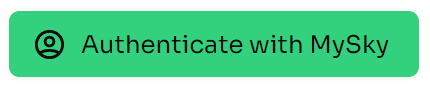
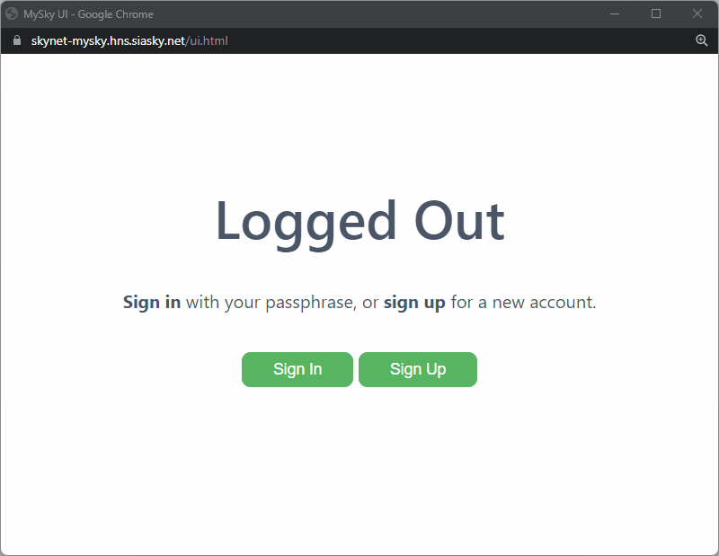
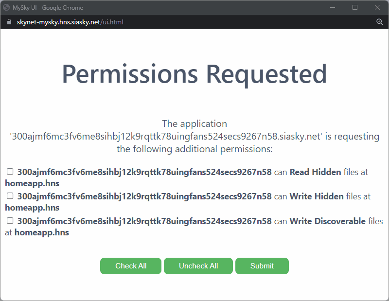

# MySky

## Introduction

MySky is a login system for the entire Skynet ecosystem. It uses modern browser security and cryptography so that all of your application data is managed by you, and central authority can disable your access.

MySky data is accessible across applications, so no application can wall you in and silo your data. Each MySky user has a unique UserID that allows their friends and followers to discover data the user has made public.

Your MySky is fully controlled by access to a secret seed phrase that is needed to login and must not be shared with anyone.


Access to your seed phrase means access to all of your Skynet data. Keep it safe and do not forget your seed phrase. No one should ever ask to know your seed phrase.


## Creating a MySky account and Logging in

When you visit a page that uses MySky, you may already be logged in! If you've used MySky before, and the application doesn't need special permissions, you will be automatically logged in.

If you need additional permissions or are not logged into MySky, you will be requested to Login or Sign Up.

### Signing Up

Signing up is as easy as clicking "Sign Up." You'll be presented with a secret seed phrase that you'll want to save somewhere secure. This is your "password" or "recovery phrase" for you MySky account, so be sure not to lose it or share it with anyone.

Next, click "Signup" and you're done!

### Signing In

If you already have a MySky account, you'll want to click signin and type or paste your seed phrase.

### Accepting Permissions

An app may ask to access files saved at a different domain than the domain it is hosted at. This might be because you're accessing an app through a new URL and it always stores its data in a specific folder. If could be because another application wants to use your data in this folder. If you're suspicious of the website you're accessing, please don't allow permissions to any domain that don't match up with the application.

## MySky Files

To determine if you want to grant permissions for an application, you might want to better understand MySky Files.

There are three types of MySky Files:

1. Discoverable
2. Encrypted _\(Grouped with Hidden Files for Permissions\)_
3. Hidden _\(not yet released\)_

| Trait | Discoverable Files | Encrypted Files | Hidden Files |
| :--- | :---: | :---: | :---: |
| Encrypted | ❌ | ✅ | ✅ |
| Associated with MySky User ID | ✅ | ✅ | ❌ |
| Accessible if UserID and File Name are Known | ✅ | ❌ | ❌ |
| Permissions needed for Read access | ❌ | ✅ | ✅ |

## Further Reading





