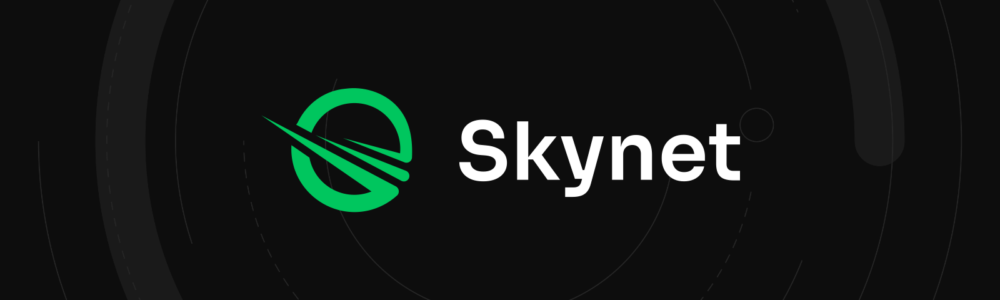

# Navigating the Skynet rebrand

With the launch of Skynet, Nebulous' focus shifted from building the leading decentralized data storage platform to enabling a user-controlled, truly decentralized internet. As a result, our company has completely [rebranded into Skynet Labs](https://blog.sia.tech/introducing-skynet-labs-434c852cce07), with all our attention on developing Skynet and its ecosystem.

The Sia storage network is now under the custody of the [Sia Foundation](https://blog.sia.tech/launching-the-sia-foundation-ee47dfab4d2c), a nonprofit that will develop Sia from here on out.

Our team and the community also frequently used the terms Nebulous/Sia/Skynet to refer to the same products and/or people. As Skynet Labs emerges and the Sia Foundation takes shape, we're taking steps to more clearly differentiate the brands across our social platforms.

Here's the changes that you'll see.

## Skynet

| What's changing? | What was it? | What is it now? |
| :--- | :--- | :--- |
| Our company name | Nebulous | Skynet Labs |
| Twitter | @SiaTechHQ | [@SkynetLabs](https://twitter.com/skynetlabs) |
| Discord | /sia | [https://discord.gg/skynetlabs](https://discord.gg/skynetlabs) |
| Facebook | @Siacoin | @SkynetLabsHQ |

* We'll continue to make Skynet and Sia related annnouncements through the Siacoin Blockfolio Signal account.
* We'll continue to share the r/siacoin subreddit with the Sia Foundation for now.
* We'll continue to share the YouTube channel for Skynet and Sia related announcements.

#### Development

* [https://gitlab.com/skynetHQ](https://gitlab.com/skynetHQ) \(moved from [https://gitlab.com/NebulousLabs](https://gitlab.com/NebulousLabs)\) is the daemon code for the Sia node
* [https://github.com/SkynetHQ](https://github.com/SkynetHQ) \(moved from [https://github.com/NebulousLabs](https://github.com/NebulousLabs)\) is the Web Dev Skynet Code. So webportal, SDKs, Accounts, etc.
* [https://gitlab.com/NebulousLabs](https://gitlab.com/NebulousLabs) is getting archived after all relevant repos are moved to Skynet or the Foundation.
* [https://github.com/NebulousLabs](https://github.com/NebulousLabs) repos were previously archived when we moved to [https://gitlab.com/NebulousLabs](https://gitlab.com/NebulousLabs)

## The Sia Foundation

| Channel | What is it now? |
| :--- | :--- |
| Website | [https://sia.tech](https://sia.tech) |
| Twitter | [@Sia\_\_Foundation](https://twitter.com/sia__foundation) |
| Discord | [https://discord.gg/sia](https://discord.gg/sia) |
| Forum | [https://forum.sia.tech](https://forum.sia.tech) |

## Development

* All foundation repos are moving from [https://gitlab.com/NebulousLabs](https://gitlab.com/NebulousLabs) to [https://github.com/SiaFoundation](https://github.com/SiaFoundation)

