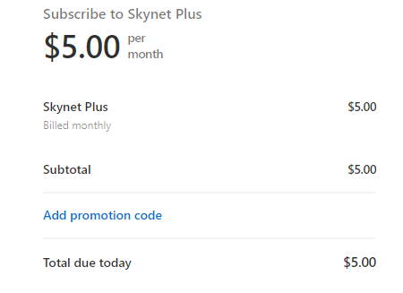

# Sign-up & Pick a Tier

## Sign Up for An Account

Visit our [sign-up page](https://account.skynetfree.net/auth/registration) for skynetfree.net to start the process of creating your account. Follow the on-screen instructions.

## Choosing a Portal

Skynet Labs operates 3 portals that can be used to access any data on Skynet:

<table><thead><tr><th>Portal Name</th><th data-type="checkbox">Account Required</th><th data-type="rating" data-max="3">Performance</th><th>Cost</th></tr></thead><tbody><tr><td><a href="https://siasky.net">Siasky.net</a></td><td>false</td><td>1</td><td>Free</td></tr><tr><td><a href="https://skynetfree.net">Skynetfree.net</a></td><td>true</td><td>2</td><td>Free</td></tr><tr><td><a href="https://skynetpro.net">Skynetpro.net</a></td><td>true</td><td>5</td><td>$5/mo and up</td></tr></tbody></table>


Siasky.net no longer allows account creation, and all user accounts should have been migrated to skynetfree.net and skynetpro.net.


## Account Tiers

When you access Skynet, your portal will identify your traffic with a "tier." The best place to start is using a free tier on Skynetfree.net. This is not a trial, but a way to use Skynet without any financial obligation and with increased performance. Files you upload and pin (up to your storage quota) will be pinned and available as long as you have an account with the portal.

### Premium Accounts

Premium accounts allow certain perks for users of the Skynet portal, and are the only account type on Skynetpro.net. The primary perk of these accounts is how large your storage quota is. In addition to this, premium account holders have prioritized access to files on Skynet and share portal resources with fewer users. They should see faster performance for file downloads and server response times. As we build toward content-monetization, premium accounts will also help support a creator economy on Skynet, and supporters can expect to see additional perks.

### Tier Comparison

| Account Tier                   | Storage Amount | Pin Duration    | Cost   | File Size Limit | File Number Limit |
| ------------------------------ | -------------- | --------------- | ------ | --------------- | ----------------- |
| **Unregistered** \| siasky.net | -              | 90 Days         | Free   | 1 GB            | -                 |
| **Free** \| skynetfree.net     | 100 GB         | Life of Account | Free   | 100 GB          | 2,500             |
| **Plus** \| skynetpro.net      | 1 TB           | Life of Account | $5/mo  | 100 GB          | 25,000            |
| **Pro** \| skynetpro.net       | 4 TB           | Life of Account | $20/mo | 100 GB          | 100,000           |
| **Extreme** \| skynetpro.net   | 20 TB          | Life of Account | $80/mo | 100 GB          | 500,000           |

## Using a Coupon code

After creating your account, you are on the "Free" tier plan. Go through the steps to subscribe to plan your coupon applies to. Then, on Stripe's payment page, look for a link that says "Add promotional code."

