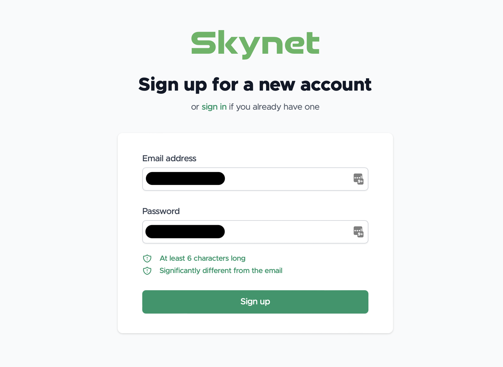
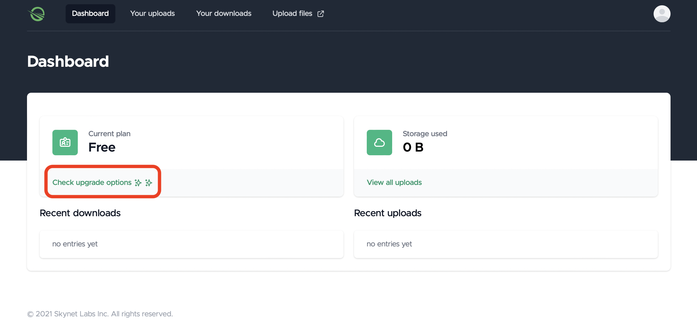

# Skynet Black Friday Promo

## New user sign up

Visit our [sign-up](https://account.siasky.net/auth/registration) page to start the process and create your account. Follow the on-screen instructions.

* Click the link above and enter an email address and password. Click **Sign up**.

Your new Skynet account is made! You'll be instantly taken to your Dashboard.

* Click **Check upgrade options**.

You'll be taken to a page showing your current tier and the other options.&#x20;

* Click **Skynet Pro** and then **Subscribe**.

You'll be taken to a payment verification screen.

* Click **Apply promotion code**. Enter **SKYNETFRIDAY**, and click **Apply**. You'll see the price drop from $20/month to $4/month.

Complete your payment details and you're done. Enjoy Skynet!

## Upgrade an existing account

If you've already got a Skynet Account, you can upgrade to Pro for 80% off for 12 months no matter what tier you are currently using.

* Go to your Skynet Dashboard and click **Check upgrade options**.

You'll see a page listing your current tier as well as your other options.

* Click **Stripe Customer Portal**.

You'll see a Billing page detailing your current plan, along with a button to update your plan.

* Click **Update plan**.

You'll see the other plan options.

* Click **Continue** next to Skynet Pro.

You'll see plan details.

* Enter promo code **SKYNETFRIDAY** to get 80% off Skynet Pro. Click **Confirm** and you're all set. Enjoy Skynet!&#x20;

