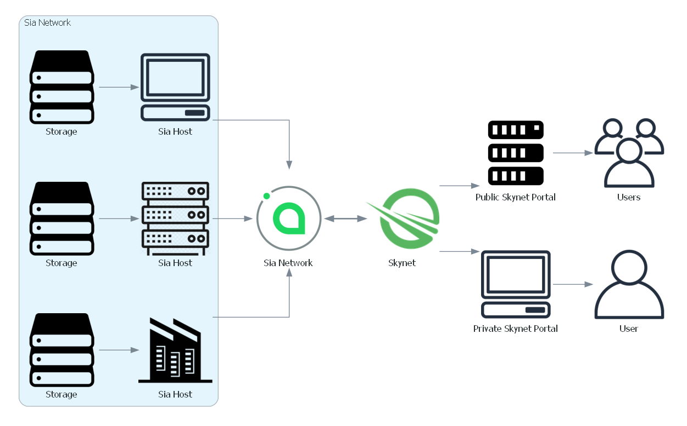

# Skynet Basics

## Skynet ❤ Sia

Skynet is built on top of a blockchain network called Sia, which first launched in 2015.

### The Gist of Sia

One way to see Sia is like Airbnb for data storage. People who need storage space \("Renters"\) can pay to store data on the hard drives of people who have extra storage space \("Hosts"\). Payment on the network is done in a special cryptocurrency called Siacoins.

Sia takes care of encrypting files and breaking them into pieces that get stored all over the world. It's open-source software and doesn't rely on any central authority. Using Sia, data can be stored and accessed quickly, securely, and affordably.


This greatly oversimplifies Sia. To learn about the project, check out the [Sia Foundation](http://sia.tech/). The foundation is a non-profit entity charged with supporting, developing, and promoting the Sia network.


While Sia is great for isolated data storage, it's not great for sharing data. What if you wanted to share a file with a friend or host a website? With Sia alone, you cannot do that.

### Skynet is Built on Top of Sia

Skynet was designed to make the benefits of Sia available across the web. It lets users store and access data on the Sia network without worrying about Siacoins or blockchains.

Skynet users access Sia using a _portal_. Web browsers and applications interact with portals just like they would with traditional websites. This abstracts away the complexities of dealing with Sia directly.


Behind the scenes, a Skynet portal is a Sia renter that rents and stores data for its users and can retrieve files from storage being rented by other portals.


Portals are an essential piece of Skynet, and we'll return to them in [Portal Basics](web-portals-on-skynet.md). For now, just know that when you see links that include [http://siasky.net/](http://siasky.net/), that's the portal operated by Skynet Labs.

## Skynet in Action

### Upload a File

In the box below, we've made a trivial skapp. You can drag and drop a file to it, and when you do, it'll upload to Skynet. Go ahead and upload something you wouldn't mind putting in public. \(If you need a file to upload, right-click [this link](https://siasky.net/CADIvje1Fdy2FP2TeBsYAbHfUsNug98wE7SYArdyczDaDg) and select "Save Link As..."\)

{% embed url="https://codesandbox.io/s/skynet-guide-widgets-jp5wt?codemirror=0&view=preview&fontsize=12&hidenavigation=1&theme=light&hidedevtools=1&initialpath=%2F%23%2Fupload" %}

### Download the File

After uploading the file, you were given a URL to download the file. Try clicking the link to view the file.

Okay, but we can do better than that. Copy the link and paste it into the box below.

{% embed url="https://codesandbox.io/s/skynet-guide-widgets-jp5wt?codemirror=0&view=preview&fontsize=12&hidenavigation=1&theme=light&hidedevtools=1&initialpath=%2F%23%2Fportals" %}

You'll notice we now have additional URLs available to us, each of which can instantly access our file.


You'll never guess what we call files hosted on Skynet. **Skyfiles!**


### Change the File & Delete the File

Want to modify or delete the file? Sorry! Once you've uploaded a file, you can't change it. You'll see why on the next page about [Accessing Data](accessing-data-on-skynet.md). You also can't delete the file. It may be removed from the network eventually, but you can learn more about that on the [Portal Basics](web-portals-on-skynet.md) page.

### Okay, What's the Big Deal?

Uploading and downloading a file isn't too fancy, but let's look at what you've done because it's actually rather exciting: 

* Once you've uploaded a file, it's instantly accessible across other portals, anywhere on the globe.
* You can later trust that the file hasn't changed or been tampered with.
* Even you, the original uploader, can't delete the file! If one portal blocks the skyfile \(or someone blocks your access to that portal\), you can still access your file through other portals.


_"Well, technically..."_  There's some nuance missing in these points, but they're a good starting point for understanding how Skynet is different from the traditional web.


In the next section, you can learn more by digging into the types of links used on Skynet for accessing data and applications.

